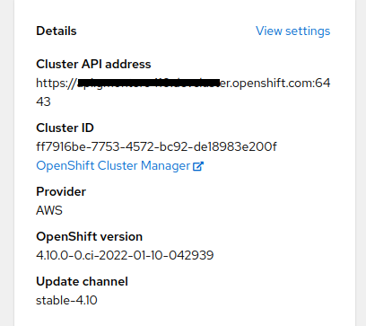
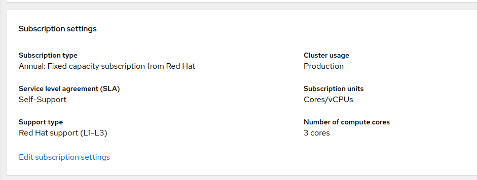
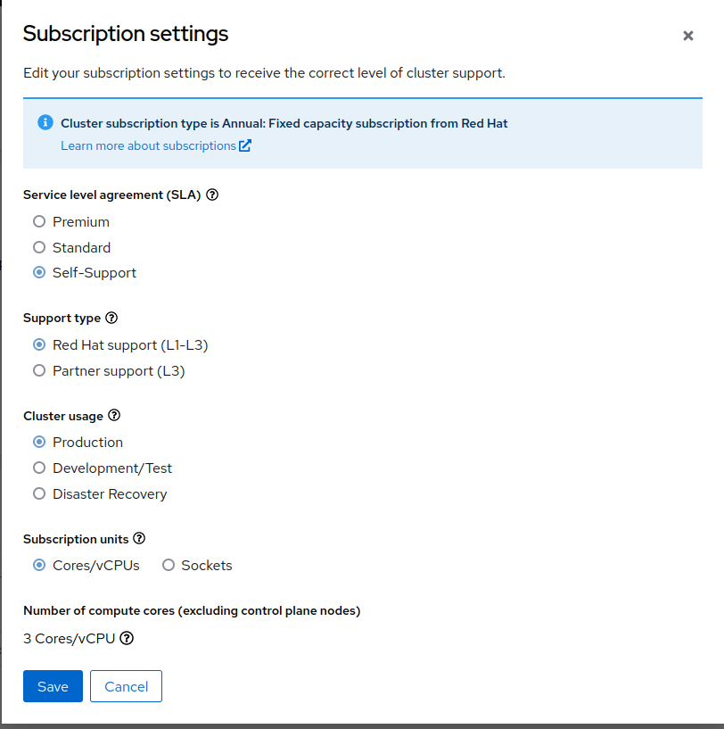

# BuildConfig example

As noted in this repositories [main README](../README.md#getting-started), Shared Resources are currently only available
on 'TechPreviewNoUpgrade' clusters.  So, unless you are employing [local development](../README.md#local-development)
you can convert your cluster to Tech Preview via:

```shell
kubectl patch featuregate cluster --type='merge' -p '{"spec":{"featureSet":"TechPreviewNoUpgrade"}}' 
```

Then, from the root directory, create/apply the various API objects defined in the YAML files in the `./examples` directory.
There are two examples there, where both use [the same namespace](../examples/00-namespace.yaml).

This document describes the [OpenShift Builds with Red Hat Entitlements](../examples/build-with-rhel-entitlements) example.

The example is an OpenShift `BuildConfig` that utilizes a `SharedSecret` for the `etc-pki-entitlement` secret in the
`openshift-config-managed` namespace, which is set up by the OpenShift Insights Operator if your install pull secret in fact has a valid
Red Hat subscription that entitles you to install Red Hat RPMs.  With a reference to this `SharedSecret`, the `BuildConfig`
is able to use your subscription information to install entitled RPMs when building an image.  Separate `Role` and
`RoleBinding` objects are defined for the `BuildConfig` and its use of the `SharedSecret`.

To install this example, run:

```shell
$ kubectl apply -R -f ./examples
```

You can start a `Build` for this `BuildConfig`, and follow the logs, via

```shell
$ oc start-build my-csi-bc -F
```

and watch as Red Hat entitled content via your subscription is installed during the running of the Docker Strategy build.
See the next section first however, if you have never used OpenShift Insights Operator to inject your subscription
credentials into your cluster.

## Notes or setting up your cluster so that Insights Operator injects your subscription credentials for use in your cluster

Tech Preview must be enabled on your OCP cluster to use the Shared Resources CSI Driver and to sync the Simple Content
Access certificate of your Red Hat account.
See [this link](https://docs.openshift.com/container-platform/4.9/post_installation_configuration/cluster-tasks.html#nodes-cluster-enabling-features-cli_post-install-cluster-tasks)
if you want to learn how to convert your cluster to a Tech Preview cluster.

Once that is sorted out, as noted up top, the Insights Operator will store your subscription credentials in the `Secret`
named `etc-pki-entitlement` in the `openshift-config-managed` namespace.  However, you'll need to perform some management
actions around your subscription and your cluster to get the Insights Operator to actually create and maintain that `Secret`

First step, log onto the OCP console for your cluster, and you should see in the top level view after logging in a link
which will take you to entry for you cluster at (http://console.redhat.com)[http://console.redhat.com].



Click that `OpenShift Cluster Manager` link and log in.  Once there, you should see a `Subscription settings` section,
with a link to edit your subscription settings.



What you see after you click the `Edit subscription settings` link will vary based on the nature of your subscription.  
Testing from the Shared Resource developers has shown you do have to select a choice beyond any sort of fixed term trial
in order to get your subscription to a place where Insights Operator will process it.  That said, "Self-support" is still
a valid option in order to access the entitled content available with your subscription.  Selecting that would look something like
this:



Once you are at this point, wait for Insights Operator to pull in your credential into the `Secret`.  NOTE: Insights
Operator does have a [polling interval](https://docs.openshift.com/container-platform/4.9/support/remote_health_monitoring/insights-operator-simple-access.html#insights-operator-configuring-sca_remote-health-reporting-from-restricted-network)
so you might not see the `etc-pki-entitlement` `Secret` get created immediately.
